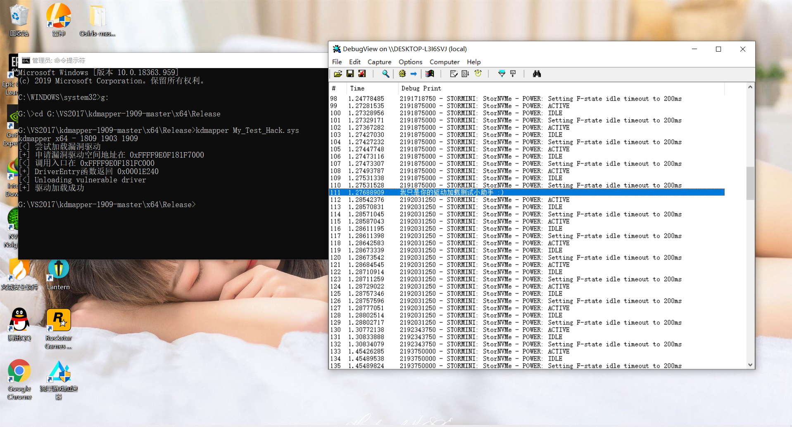

# kdmapper
驱动加载器 -> 利用iqvw64e.sys映射驱动

<h1 align="center">
	
</h1>

## 不需要进入Win10的测试模式也能装载驱动

## 请用管理员的权限运行CMD,否则权限不够装载失败

## x64还是x86,看清楚

## 项目 -> 属性 -> 链接器 -> 输入 -> 附加依赖项:

ntdll.lib
kernel32.lib
user32.lib
gdi32.lib
winspool.lib
comdlg32.lib
advapi32.lib
shell32.lib
ole32.lib
oleaut32.lib
uuid.lib
odbc32.lib
odbccp32.lib

